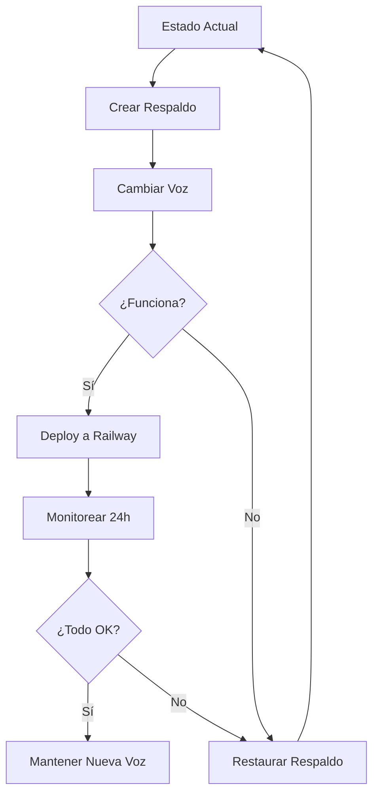

# Sistema de Gestión de Voces - Bruce W

Sistema completo para cambiar la voz de Bruce con respaldos automáticos.

## Inicio Rápido

### 1. Crear Respaldo (SIEMPRE PRIMERO)

```bash
cd "C:\Users\PC 1\AgenteVentas"
python cambiar_voz_rapido.py backup voz_masculina_original
```

### 2. Cambiar a Voz Femenina

```bash
python cambiar_voz_rapido.py cambiar domi_femenino
```

**Costo**: 86,660 créditos (~$19 USD)
**Tiempo**: 15-20 minutos

### 3. Deploy a Railway

```bash
git add audio_cache/
git commit -m "Cambio de voz: Domi femenina"
git push origin main
```

### 4. Si No Gusta, Restaurar

```bash
python cambiar_voz_rapido.py restaurar voz_masculina_original
git add audio_cache/
git commit -m "Restaurar voz masculina original"
git push origin main
```

---

## Archivos Creados

| Archivo | Descripción |
|---------|-------------|
| `gestor_voces_elevenlabs.py` | Script principal con menú interactivo |
| `cambiar_voz_rapido.py` | Script de comandos rápidos |
| `cambiar_voz.bat` | Script Windows batch |
| `GUIA_CAMBIO_VOZ.md` | Documentación completa |
| `README_VOCES.md` | Este archivo |

---

## Comandos Disponibles

### Script Rápido (Recomendado)

```bash
# Ver ayuda
python cambiar_voz_rapido.py

# Crear respaldo
python cambiar_voz_rapido.py backup [nombre]

# Listar voces
python cambiar_voz_rapido.py listar-voces

# Ver respaldos
python cambiar_voz_rapido.py listar-respaldos

# Cambiar voz
python cambiar_voz_rapido.py cambiar <voz_key>

# Restaurar
python cambiar_voz_rapido.py restaurar <nombre_respaldo>
```

### Menú Interactivo

```bash
python gestor_voces_elevenlabs.py
```

### Windows Batch

```bash
cambiar_voz.bat menu
```

---

## Voces Disponibles

| Key | Nombre | Tipo | Recomendación |
|-----|--------|------|---------------|
| `bruce_masculino` | Bruce Original | Masculina | Actual en producción ✅ |
| `domi_femenino` | Domi | Femenina | **Mejor opción femenina** ⭐ |
| `jessica_femenino` | Jessica | Femenina | Más formal |
| `matilda_femenino` | Matilda | Femenina | Más cálida |

---

## Respaldos

Los respaldos se guardan en `audio_cache_backups/`:

```
audio_cache_backups/
├── voz_masculina_original/        # Tu respaldo manual
├── auto_backup_20260211_203045/   # Respaldo automático
└── backup_antes_cambio_voz_*/     # Respaldos pre-cambio
```

Cada respaldo incluye:
- 1,238 archivos MP3 (~118 MB)
- metadata.json con info del respaldo
- cache_audios.json con índice de frases

---

## Flujo Completo



---

## Troubleshooting

### Error: API Key no encontrada

```bash
# Verificar .env
cat .env | grep ELEVENLABS_API_KEY
```

### Error: No hay créditos suficientes

1. Ve a https://elevenlabs.io/app/usage
2. Verifica que tienes >86,660 créditos disponibles
3. Compra más créditos o espera al reset mensual

### Respaldo no restaura correctamente

```bash
# Verificar integridad del respaldo
python -c "from gestor_voces_elevenlabs import listar_respaldos; listar_respaldos()"

# Verificar archivos
ls audio_cache_backups/[nombre_respaldo]/*.mp3 | wc -l
# Debe retornar: 1238
```

---

## Documentación Completa

Lee `GUIA_CAMBIO_VOZ.md` para:
- Mejores prácticas
- Checklist completo
- Troubleshooting avanzado
- Estructura de archivos
- Costos detallados

---

## Próximos Pasos

Después de cambiar la voz:

1. ✅ Hacer 2-3 llamadas de prueba localmente
2. ✅ Verificar que audio suena bien
3. ✅ Deploy a Railway
4. ✅ Hacer llamada de prueba en producción
5. ✅ Monitorear bugs las primeras 24h
6. ✅ Mantener respaldo anterior 1 semana mínimo
